# ARX5 Real-World Imitation Learning

Real-world visuomotor imitation learning on an ARX5 X5 robot arm. This repository covers human demonstration collection, three-camera RGB plus robot-state datasets, Diffusion Policy / ACT-style training adapters, action-chunk scheduling, latency-aware deployment, and real-robot execution through the ARX5 SDK.

This is not a standalone SOTA algorithm release. Diffusion Policy is the primary baseline; ACT and previous-action-conditioned DP-CFG are experimental comparison branches adapted to the ARX5 workflow.


https://github.com/user-attachments/assets/1e295701-18bd-4eb9-9f59-b7812b6429cc


## Overview

```mermaid
flowchart LR
    Demo[Human demonstration<br/>SpaceMouse] --> Collector[ARX5 collector]
    Collector --> ObsAct[Observation + expert action<br/>3 RGB cameras + robot state + target action]
    ObsAct --> Buffer[Replay buffer<br/>replay_buffer.zarr + videos]
    Buffer --> Dataset[Dataset loaders<br/>DP / DP-CFG / ACT]
    Dataset --> Train[Training]
    Train --> Ckpt[Checkpoint]
    Ckpt --> Runtime[Deployment runtime]
    Runtime --> Chunk[Action chunk<br/>EEF or joint + gripper]
    Chunk --> SDK[ARX5 SDK / CAN]
    SDK --> Robot[ARX5 X5]
```



The core value of this project is the real-robot system integration around policy learning: synchronized data collection, schema-compatible replay buffers, camera-order handling, checkpoint inspection, action-chunk timing, reset handling, and deployment diagnostics.

## Key Features

- Real ARX5 X5 robot learning pipeline from demonstration to deployment.
- SpaceMouse teleoperation for human demonstrations.
- Three-camera RGB observations with robot proprioception.
- Episode-based dataset format using `replay_buffer.zarr` plus per-episode camera videos.
- DP-EEF and DP-Joint dataset/training/deployment paths.
- ACT adapter with EEF and joint state/action modes.
- DP-CFG experimental branch with previous-action conditioning, masks, CFG guidance, and tracking-error gating.
- Action-chunk timestamp scheduling with expired-action filtering, future trajectory replacement, blending, and continuous executors.
- Dataset and checkpoint audit utilities for shape, timestamp, camera, and alignment checks.

## Current Policy Status

Status describes repository maturity, not benchmark superiority.

| Policy | Action Space | Training | Real Robot | Current Status | Notes |
| --- | --- | --- | --- | --- | --- |
| DP-EEF | 7D EEF pose + gripper width | Yes | Yes | STABLE baseline | Primary working baseline for this repository. |
| DP-Joint | 6 joint targets + gripper width | Yes | Yes | EXPERIMENTAL | Online joint executor exists; behavior is still under comparison with DP-EEF. |
| ACT-EEF | EEF qpos/action chunk | Yes | Yes | EXPERIMENTAL | ACT adapter and deployment path exist; no curated benchmark table. |
| ACT-Joint | Joint qpos/action chunk | Yes | Yes | EXPERIMENTAL | Joint-mode online path uses `JointActRobot`; no public success-rate claim. |
| DP-CFG | 7D EEF action + previous-action condition | Yes | Yes | EXPERIMENTAL | Implements previous-action-conditioned prototype; not claimed to outperform vanilla DP. |
| DP3 / point cloud | Not active in this snapshot | No active path confirmed | No active path confirmed | WIP / not active | Not presented as completed functionality. |
| MoE / MDR | No active implementation found | No | No | WIP / not active | Mentioned only as future/ongoing exploration. |

## Main Findings

- DP-EEF remains the most stable real-robot baseline documented by the project notes.
- Action scheduling, timestamp choice, inference latency, and chunk boundary handling materially affect real-robot motion quality.
- ACT temporal aggregation can produce smoother motion in tested settings, but no controlled success-rate benchmark is published.
- Previous-action-conditioned DP-CFG can influence trajectory continuity, but current records do not prove a stable task-performance gain over vanilla DP.
- Strong previous-action conditioning may reduce observation-driven correction and can lead to dominant or fixed trajectory behavior.

No controlled success-rate benchmark is reported in this v1 repository. Public claims should stay at implementation and observed-behavior level until matched-trial evaluation logs are curated.

## Repository Structure

```text
.
├── scripts/                          # stable train/deploy wrappers
├── diffusion_policy-main/
│   ├── arx5_collector/               # ARX5 data collection and dataset utilities
│   ├── arx5_ckpt_loader/             # DP checkpoint loading and deployment
│   └── diffusion_policy/             # adapted Diffusion Policy code and ARX5 configs
├── arx5_dp_cfg/                      # previous-action-conditioned DP-CFG experiment
├── arx5_act/                         # ACT dataset/training/deployment adapter
├── act-main/                         # ACT / DETR dependency snapshot
├── arx5-sdk-main/                    # ARX5 SDK snapshot
├── docs/                             # architecture, data schema, deployment, audits
├── assets/                           # public figure/demo placeholders
└── tools/                            # lightweight utility scripts
```

Ignored local artifacts:

```text
diffusion_policy-main/data_local/      # local datasets, videos, caches
diffusion_policy-main/data/outputs/    # local DP checkpoints and outputs
act_outputs/                           # local ACT checkpoints
logs/                                  # local training/deployment logs
project_trash/                         # historical archive, not part of public v1
```

## Quick Start

This is hardware-specific research code. Real-robot usage requires the ARX5 SDK, CAN setup, camera access, and SpaceMouse support.

### 1. Environment

```bash
git clone <repo-url>
cd arx5-imitation-learning

conda env create -f conda_environment_arx5_real.yaml
source ./activate_arx5_env.sh
```

Check import-level entry points before using hardware:

```bash
python -m arx5_ckpt_loader.load_arx5_ckpt --help
export PYTHONPATH="$(pwd):$(pwd)/diffusion_policy-main:${PYTHONPATH:-}"
python -m arx5_act.train_act --help
python -m arx5_dp_cfg.run_arx5_cfg_policy --help
```

### 2. Hardware Check

```bash
./start_can1.sh

cd diffusion_policy-main
python -m arx5_collector.scripts.test_robot --model X5 --interface can1
python -m arx5_collector.scripts.test_spacemouse
python -m arx5_collector.scripts.test_cameras --usb-device 0
```

### 3. Data Collection

```bash
cd diffusion_policy-main

python -m arx5_collector.scripts.collect_demo \
  --output data_local/example_task \
  --model X5 \
  --interface can1 \
  --usb-device 0
```

Dataset layout:

```text
data_local/example_task/
├── replay_buffer.zarr/
└── videos/
    ├── 0/
    │   ├── 0.mp4
    │   ├── 1.mp4
    │   └── 2.mp4
    └── ...
```

### 4. Dataset Audit

```bash
python -m arx5_collector.scripts.analyze_recordings data_local/example_task
python -m arx5_collector.scripts.inspect_training_dataset --dataset-path data_local/example_task
python -m arx5_collector.scripts.check_dataset_alignment --dataset-path data_local/example_task
```

### 5. Diffusion Policy Training

DP-EEF:

```bash
cd ..

RUN_NAME=example_dp_eef \
DATASET_PATH=data_local/example_task \
EPOCHS=200 \
BATCH_SIZE=16 \
./scripts/train_dp_eef.sh
```

DP-Joint:

```bash
RUN_NAME=example_dp_joint \
DATASET_PATH=data_local/example_task \
EPOCHS=200 \
BATCH_SIZE=16 \
./scripts/train_dp_joint.sh
```

### 6. Diffusion Policy Deployment

Deployment commands can move the real robot. Verify camera order, workspace, CAN interface, gripper calibration, and reset behavior before using `--execute` through the wrapper.

```bash
CKPT_PATH=data/outputs/manual/example_dp_eef/checkpoints/latest.ckpt \
DP_VIDEO_DEVICES=0,6,12 \
./scripts/run_dp_pro.sh
```

```bash
CKPT_PATH=data/outputs/manual/example_dp_joint/checkpoints/latest.ckpt \
DP_JOINT_VIDEO_DEVICES=0,6,12 \
./scripts/run_dp_joint_pro.sh
```

### 7. ACT

```bash
RUN_NAME=example_act_joint \
DATASET_PATH=data_local/example_task \
ACT_STATE_MODE=joint \
ACT_EPOCHS=200 \
ACT_BATCH_SIZE=16 \
./scripts/train_act.sh
```

```bash
./scripts/run_act_joint_pro.sh --execute
```

### 8. DP-CFG

```bash
RUN_NAME=example_dp_cfg_prev4 \
DATASET_PATH=data_local/example_task \
PREV_COND_STEPS=4 \
PREV_CHUNK_DROPOUT=0.3 \
EPOCHS=200 \
BATCH_SIZE=16 \
./scripts/train_dp_eef_cfg.sh
```

```bash
CKPT_PATH=data/outputs/manual/example_dp_cfg_prev4/checkpoints/latest.ckpt \
CFG_VIDEO_DEVICES=0,6,12 \
CFG_PREV_COND_STEPS=4 \
CFG_W=0.5 \
./scripts/run_dp_cfg_pro.sh
```

## Documentation

- [docs/ARCHITECTURE.md](docs/ARCHITECTURE.md): offline and online system architecture.
- [docs/DATA_SCHEMA.md](docs/DATA_SCHEMA.md): dataset layout, camera mapping, observations, actions, timestamps.
- [docs/DEPLOYMENT.md](docs/DEPLOYMENT.md): action chunks, scheduling, latency, continuous execution.
- [docs/EXPERIMENTS.md](docs/EXPERIMENTS.md): branch goals, implementation status, observed behavior, limitations.
- [docs/RESULTS_AUDIT.md](docs/RESULTS_AUDIT.md): evidence-first result audit.
- [docs/ATTRIBUTION.md](docs/ATTRIBUTION.md): upstream work vs repository-specific implementation.
- [REPOSITORY_AUDIT.md](REPOSITORY_AUDIT.md): feature-by-feature public-claim audit.

## Results and Limitations

- No fabricated success-rate benchmark is included.
- Local datasets, videos, checkpoints, W&B runs, and logs are intentionally ignored by Git.
- This repository is tied to the ARX5 X5 hardware stack and local camera/CAN setup.
- DP-CFG remains an experimental branch; smoothness observations are not presented as task-performance improvements.
- Point-cloud / DP3 / MoE branches are not active in this repository snapshot.
- Comparable evaluation should use the same dataset split, camera order, reset protocol, object placement set, and failure criteria.

## Attribution

This repository builds on Diffusion Policy, ACT / DETR, SAIL-style previous-action conditioning ideas, the ARX5 SDK, PyTorch, Robomimic, Diffusers, RealSense tooling, and related robotics dependencies.

Repository-specific work includes ARX5 hardware integration, three-camera data collection, DP-compatible dataset schema, ARX5 dataset adapters, EEF/joint action conversion, checkpoint loading, real-robot deployment wrappers, action-chunk timestamp scheduling, latency handling, continuous executors, reset/safety utilities, and audit/debugging tools.

See [docs/ATTRIBUTION.md](docs/ATTRIBUTION.md) for details.
