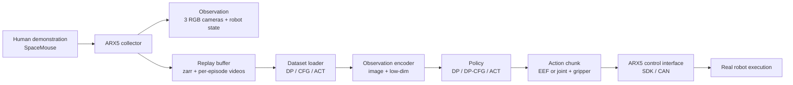

# ARX5 Imitation Learning

Real-world visuomotor imitation learning on an ARX5 robot arm, from human demonstration collection to policy training and real-robot action-chunk deployment.

> **Demo status:** a public demo GIF/video is not included in this v1 checkout yet. Raw robot videos are kept out of Git for privacy and size reasons. See [docs/DEMO_PLAN.md](docs/DEMO_PLAN.md) for the planned public demo set.

## At A Glance

- **Robot:** physical ARX5 X5 arm with gripper.
- **Task setting:** real tabletop manipulation demonstrations and deployment.
- **Observations:** three RGB cameras plus robot proprioception.
- **Actions:** end-effector pose chunks or joint-position chunks with gripper width.
- **Policies:** Diffusion Policy EEF, Diffusion Policy Joint, previous-action-conditioned DP-CFG, ACT EEF, and ACT Joint.
- **Completed pipeline:** SpaceMouse teleoperation -> synchronized dataset -> DP/ACT-style loader -> training -> checkpoint inspection -> ARX5 deployment.

## Engineering Highlights

- **Real-robot data collection:** records ARX5 state, target actions, gripper state, timestamps, and three synchronized RGB videos into an episode-based dataset.
- **ARX5 dataset adapters:** converts the same raw demonstrations into DP-EEF, DP-Joint, ACT-EEF, ACT-Joint, and DP-CFG training samples.
- **Action-chunk deployment:** loads trained checkpoints and executes predicted action chunks on the ARX5 through the SDK with reset, human-hold, and safety-aware wrappers.
- **Deployment diagnostics:** includes tools for dataset alignment, checkpoint inspection, action timing, previous-action conditioning, and trajectory logging.

## Architecture



Detailed data and inference pipelines are documented in [docs/architecture.md](docs/architecture.md).

## Implemented Methods

| Method | Observation | Action representation | Real robot path | Status |
| --- | --- | --- | --- | --- |
| DP-EEF | RGB + EEF pose/gripper | EEF pose + gripper width | Yes | Working baseline |
| DP-Joint | RGB + joint/gripper state | 6 joint targets + gripper width | Yes | Experimental |
| DP-CFG | RGB + EEF pose/gripper + previous action condition | EEF pose + gripper width | Yes | Experimental |
| ACT-EEF | RGB + EEF qpos | EEF action chunk | Yes | Experimental |
| ACT-Joint | RGB + joint qpos | Joint action chunk | Yes | Experimental |
| DP3 / point cloud | Unknown in this checkout | Unknown | Not confirmed | TODO / not active |
| MoE / MDR | Not present in active code path | Unknown | Not confirmed | Ongoing / needs review |

No success-rate table is published in v1 because comparable evaluation logs have not been curated. See [docs/RESULTS_AUDIT.md](docs/RESULTS_AUDIT.md) and [docs/EXPERIMENT_TEMPLATE.md](docs/EXPERIMENT_TEMPLATE.md).

## Current Status

- [x] ARX5 real-world demonstration collection.
- [x] Multi-camera RGB video + robot-state dataset format.
- [x] DP-EEF training and real-robot deployment path.
- [x] DP-Joint training and deployment path for comparison.
- [x] ACT EEF/Joint baseline path.
- [x] DP-CFG previous-action-conditioned experiment path.
- [x] Dataset alignment and checkpoint inspection tools.
- [ ] Public curated demo video.
- [ ] Unified success-rate benchmark.
- [ ] Public multi-task / MoE ablation.
- [ ] Active DP3 / point-cloud release path.

## Quick Start

This is research code with hardware-specific dependencies. The real-robot stack requires the ARX5 SDK, CAN setup, RealSense/V4L2 camera access, and SpaceMouse support.

```bash
git clone <repo-url>
cd CY_arx5_dp

conda env create -f conda_environment_arx5_real.yaml
source ./activate_arx5_env.sh
```

Check non-robot imports first:

```bash
python -m arx5_ckpt_loader.load_arx5_ckpt --help
export PYTHONPATH="$(pwd)/..:$PYTHONPATH"
python -m arx5_act.train_act --help
python -m arx5_dp_cfg.run_arx5_cfg_policy --help
```

## Data Collection

```bash
python -m arx5_collector.scripts.collect_demo \
  --output data_local/example_task \
  --model X5 \
  --interface can1 \
  --usb-device 0
```

Dataset layout:

```text
data_local/example_task/
├── replay_buffer.zarr/
└── videos/
    ├── 0/
    │   ├── 0.mp4
    │   ├── 1.mp4
    │   └── 2.mp4
    └── ...
```

Run checks before training:

```bash
python -m arx5_collector.scripts.analyze_recordings data_local/example_task
python -m arx5_collector.scripts.inspect_training_dataset --dataset-path data_local/example_task
python -m arx5_collector.scripts.check_dataset_alignment --dataset-path data_local/example_task
```

More detail: [docs/DATA_PIPELINE.md](docs/DATA_PIPELINE.md).

## Training

DP-EEF:

```bash
RUN_NAME=example_dp_eef \
DATASET_PATH=data_local/example_task \
EPOCHS=200 \
BATCH_SIZE=16 \
./scripts/train_dp_eef.sh
```

DP-Joint:

```bash
RUN_NAME=example_dp_joint \
DATASET_PATH=data_local/example_task \
EPOCHS=200 \
BATCH_SIZE=16 \
./scripts/train_dp_joint.sh
```

DP-CFG:

```bash
RUN_NAME=example_dp_cfg_prev4 \
DATASET_PATH=data_local/example_task \
PREV_COND_STEPS=4 \
PREV_CHUNK_DROPOUT=0.3 \
EPOCHS=200 \
BATCH_SIZE=16 \
./scripts/train_dp_eef_cfg.sh
```

ACT:

```bash
RUN_NAME=example_act_joint \
DATASET_PATH=data_local/example_task \
ACT_STATE_MODE=joint \
ACT_EPOCHS=200 \
ACT_BATCH_SIZE=16 \
./scripts/train_act.sh
```

## Real Robot Deployment

Deployment scripts can move the real robot. Verify camera order, CAN interface, gripper calibration, reset behavior, and workspace safety before enabling execution.

Inspect a DP checkpoint without robot motion:

```bash
python -m arx5_ckpt_loader.load_arx5_ckpt \
  --ckpt data/outputs/manual/example_dp_eef/checkpoints/latest.ckpt \
  --device cpu
```

Run DP-EEF:

```bash
CKPT_PATH=data/outputs/manual/example_dp_eef/checkpoints/latest.ckpt \
DP_VIDEO_DEVICES=0,6,12 \
./scripts/run_dp_pro.sh
```

Run DP-Joint:

```bash
CKPT_PATH=data/outputs/manual/example_dp_joint/checkpoints/latest.ckpt \
DP_JOINT_VIDEO_DEVICES=0,6,12 \
./scripts/run_dp_joint_pro.sh
```

Run DP-CFG:

```bash
CKPT_PATH=data/outputs/manual/example_dp_cfg_prev4/checkpoints/latest.ckpt \
CFG_VIDEO_DEVICES=0,6,12 \
CFG_PREV_COND_STEPS=4 \
CFG_W=0.5 \
./scripts/run_dp_cfg_pro.sh
```

## Demos

The README should eventually show one short primary demo near the top:

```text
assets/demos/arx5_dp_grasp_main.gif
```

Additional videos should be linked from releases or external storage instead of committed as large files. Planned demo shots are listed in [docs/DEMO_PLAN.md](docs/DEMO_PLAN.md).

## Repository Structure

```text
.
├── scripts/                          # stable train/deploy wrappers
├── diffusion_policy-main/
│   ├── arx5_collector/               # ARX5 data collection
│   ├── arx5_ckpt_loader/             # DP checkpoint loading/deployment
│   └── diffusion_policy/             # DP code plus ARX5 dataset/configs
├── arx5_dp_cfg/                      # previous-action-conditioned DP experiment
├── arx5_act/                         # ACT dataset/training/deployment adapter
├── act-main/                         # ACT/DETR dependency snapshot
├── arx5-sdk-main/                    # ARX5 SDK snapshot
├── assets/                           # public figures/demo placeholders
└── docs/                             # project maps, pipeline docs, audits
```

`project_trash/`, datasets, checkpoints, videos, and logs are ignored and should not be part of the public release.

## Documentation

- [docs/PROJECT_MAP.md](docs/PROJECT_MAP.md): file-level project map.
- [docs/DATA_PIPELINE.md](docs/DATA_PIPELINE.md): raw data to training sample.
- [docs/architecture.md](docs/architecture.md): data and inference architecture.
- [docs/EXPERIMENTS.md](docs/EXPERIMENTS.md): method map and experiment status.
- [docs/RESULTS_AUDIT.md](docs/RESULTS_AUDIT.md): what results are currently publishable.
- [docs/PUBLIC_RELEASE_CHECKLIST.md](docs/PUBLIC_RELEASE_CHECKLIST.md): public release risk checklist.

## Roadmap

- Add a curated public robot demo.
- Standardize evaluation protocols and success-rate reporting.
- Compare EEF, joint, CFG, and ACT on the same held-out task distribution.
- Improve dataset quality scoring and visualization.
- Explore flow matching and multi-task routing only after the main DP/ACT baselines are stable.

## Acknowledgements

This project adapts and builds on Diffusion Policy, ACT / DETR, the ARX5 SDK, PyTorch, Robomimic, Diffusers, RealSense tooling, and related robotics dependencies. Keep upstream licenses and attribution files when publishing.

