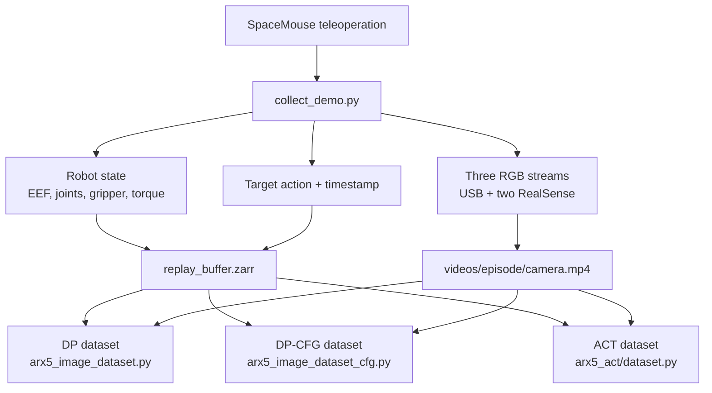
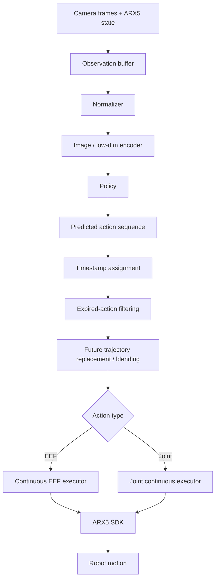

# Architecture

This document explains the current repository architecture for the ARX5 imitation-learning workflow. It separates offline data/training from online real-robot deployment and marks experimental branches conservatively.

## System Overview

```mermaid
flowchart LR
    subgraph Offline[Offline Data Collection & Training]
        Demo[Human Demonstration<br/>SpaceMouse teleoperation]
        Collector[ARX5 Collector]
        ObsAct[Observation + Expert Action<br/>3 RGB cameras + robot state + target action]
        Replay[Replay Buffer<br/>replay_buffer.zarr + videos]
        Loader[Dataset Loader<br/>DP / DP-CFG / ACT]
        Train[Training]
        Ckpt[Checkpoint]

        Demo --> Collector
        Collector --> ObsAct
        ObsAct --> Replay
        Replay --> Loader
        Loader --> Train
        Train --> Ckpt
    end

    subgraph Online[Online Real-Robot Deployment]
        Runtime[Deployment Runtime]
        Obs[Online Observation<br/>camera frames + robot state]
        Policy[Policy Inference]
        Chunk[Action Sequence]
        EEF[EEF action path]
        Joint[Joint action path]
        Executor[Timestamped Executor]
        SDK[ARX5 SDK / CAN]
        Robot[ARX5 X5]

        Runtime --> Obs
        Obs --> Policy
        Policy --> Chunk
        Chunk --> EEF
        Chunk --> Joint
        EEF --> Executor
        Joint --> Executor
        Executor --> SDK
        SDK --> Robot
        Robot --> Obs
    end

    Ckpt --> Runtime
```

## Offline Pipeline

Core files:

- `diffusion_policy-main/arx5_collector/scripts/collect_demo.py`
- `diffusion_policy-main/arx5_collector/data/dp_episode_writer.py`
- `diffusion_policy-main/diffusion_policy/dataset/arx5_image_dataset.py`
- `arx5_dp_cfg/arx5_image_dataset_cfg.py`
- `arx5_act/dataset.py`

## Online Pipeline

Deployment entry points:

- DP-EEF: `diffusion_policy-main/arx5_ckpt_loader/run_arx5_policy.py`
- DP-Joint: `diffusion_policy-main/arx5_ckpt_loader/run_arx5_joint_policy.py`
- DP-CFG: `arx5_dp_cfg/run_arx5_cfg_policy.py`
- ACT: `arx5_act/run_act_policy.py`

## Policy / Action / Robot Relationship

| Branch | Observation | Policy output | Robot path | Status |
| --- | --- | --- | --- | --- |
| DP-EEF | `camera_0/1/2`, `robot0_eef_pos`, `robot0_eef_rot_axis_angle`, `robot0_gripper_width` | 7D EEF pose + gripper | `run_arx5_policy.py` -> continuous EEF executor -> SDK | STABLE baseline |
| DP-Joint | `camera_0/1/2`, `robot_joint`, `robot_gripper` | 6 joint targets + gripper | `run_arx5_joint_policy.py` -> joint continuous executor -> SDK | EXPERIMENTAL |
| DP-CFG | DP-EEF obs plus `prev_action` and `prev_action_mask` | 7D EEF pose + gripper | `run_arx5_cfg_policy.py` -> continuous EEF executor -> SDK | EXPERIMENTAL |
| ACT-EEF | RGB cameras + EEF qpos | EEF action chunk | `run_act_policy.py` EEF branch -> scheduler -> SDK | EXPERIMENTAL |
| ACT-Joint | RGB cameras + joint qpos | joint action chunk | `run_act_policy.py` joint branch -> `JointActRobot` | EXPERIMENTAL |

## Active vs Not Active

Point-cloud and DP3 modules are not active in this repository snapshot. MoE/MDR are not presented as completed active functionality. The current active work is the ARX5 RGB imitation-learning stack around DP, ACT, and DP-CFG.
