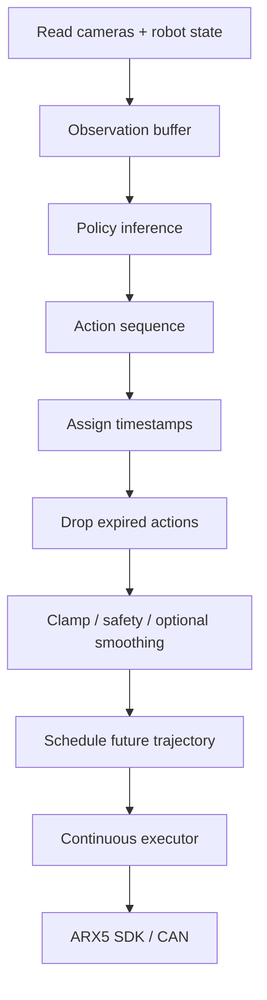

# Deployment

Deployment is one of the main engineering contributions of this repository. The trained policy does not directly move the robot by itself; it produces action chunks that must be timestamped, filtered, and sent through an ARX5-compatible execution layer.

## Runtime Loop



## Observation

Online observation combines:

- three RGB camera frames
- robot EEF pose or joint state
- gripper state

The observation keys must match the checkpoint `shape_meta`. A camera-order mismatch can produce valid tensors but poor robot behavior.

## Policy Inference

The policy outputs an action sequence. For the current DP configs, the common pattern is:

- prediction horizon: `16`
- observation steps: `2`
- scheduled action steps: usually `7` or `8`, depending on wrapper settings

ACT uses action chunks with a larger chunk size and optional temporal aggregation.

## Timestamping and Latency

Deployment wrappers expose:

- policy frequency
- command latency
- action execution latency
- preview time
- replan lookahead
- timestamp mode

These parameters decide when each predicted waypoint should be executed. If inference is late, some predicted points may already be stale by the time the chunk is ready.

## Expired Action Filtering

Runtime filters actions whose timestamps are too old. This prevents sending commands that refer to the past, but it can also shorten a chunk if inference latency is high.

## Future Trajectory Replacement and Blending

Continuous executors maintain future waypoints. When a new chunk arrives, the runtime can:

- append future commands
- replace future commands
- blend the start of a replacement chunk against the previous future trajectory

This is used to reduce chunk-boundary discontinuities without changing the trained checkpoint.

## EEF Path

DP-EEF and DP-CFG use 7D EEF targets:

```text
[x, y, z, rx, ry, rz, gripper_width]
```

Relevant files:

```text
diffusion_policy-main/arx5_ckpt_loader/run_arx5_policy.py
arx5_dp_cfg/run_arx5_cfg_policy.py
diffusion_policy-main/arx5_ckpt_loader/deployment/continuous_executor.py
```

## Joint Path

DP-Joint and ACT-Joint use 7D joint targets:

```text
[q1, q2, q3, q4, q5, q6, gripper_width]
```

Relevant files:

```text
diffusion_policy-main/arx5_ckpt_loader/run_arx5_joint_policy.py
diffusion_policy-main/arx5_ckpt_loader/deployment/joint_continuous_executor.py
arx5_act/deployment/joint_robot.py
```

## Safety and Reset

Deployment wrappers include:

- human mode / policy mode switching
- reset-to-home/session utilities
- gripper clamp and torque safety
- tracking guard / hold logic
- trajectory logging

These are engineering safeguards, not formal safety certification.

## Known Deployment Risks

- Camera order can change after unplugging/replugging devices.
- A checkpoint can load successfully while receiving mismatched observation semantics.
- Low training loss does not guarantee real-robot success.
- Chunk boundaries and inference latency can produce discontinuous motion if timestamping is wrong.
- Strong action conditioning in DP-CFG can reduce observation-driven correction.
