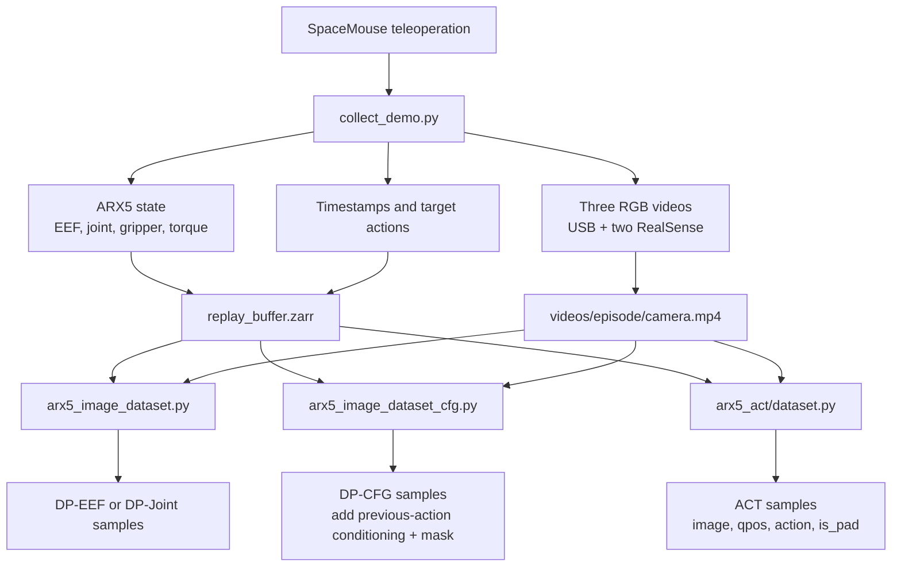
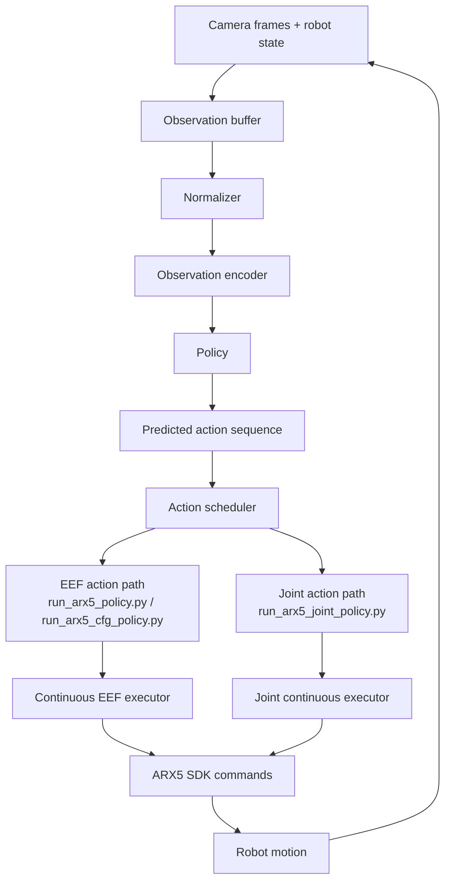

# Architecture

This document separates the offline data/training pipeline from the online inference/deployment pipeline.

## Simplified System Figure

```mermaid
flowchart LR
    subgraph Offline[Offline Data Collection & Training]
        Demo[Human Demonstration<br/>SpaceMouse teleoperation]
        Collect[ARX5 Collector]
        ObsAct[Observation + Expert Action<br/>RGB + robot state + target action]
        Data[Replay Buffer<br/>zarr + per-episode videos]
        Loader[Dataset Loader]
        Train[Policy Training<br/>DP / DP-CFG / ACT]
        Ckpt[Checkpoint]

        Demo --> Collect
        Collect --> ObsAct
        ObsAct --> Data
        Data --> Loader
        Loader --> Train
        Train --> Ckpt
    end

    subgraph Online[Online Real-Robot Deployment]
        Deploy[Deployment Runtime]
        Chunk[Action Chunk<br/>EEF or joint + gripper]
        SDK[ARX5 SDK / CAN]
        Robot[ARX5 Robot]

        Deploy --> Chunk
        Chunk --> SDK
        SDK --> Robot
    end

    Ckpt --> Deploy
```

## Data Pipeline

Core files:

- `diffusion_policy-main/arx5_collector/scripts/collect_demo.py`
- `diffusion_policy-main/arx5_collector/data/dp_episode_writer.py`
- `diffusion_policy-main/diffusion_policy/dataset/arx5_image_dataset.py`
- `arx5_dp_cfg/arx5_image_dataset_cfg.py`
- `arx5_act/dataset.py`

## Inference Pipeline

Deployment variants:

- DP-EEF: `diffusion_policy-main/arx5_ckpt_loader/run_arx5_policy.py`
- DP-Joint: `diffusion_policy-main/arx5_ckpt_loader/run_arx5_joint_policy.py`
- DP-CFG: `arx5_dp_cfg/run_arx5_cfg_policy.py`
- ACT: `arx5_act/run_act_policy.py`

## Observation, Policy, Action, Robot

| Layer | Current implementation |
| --- | --- |
| Observation | `camera_0`, `camera_1`, `camera_2`, EEF pose/gripper or joint/gripper state |
| Policy | Diffusion Policy, previous-action-conditioned DP-CFG, ACT baseline |
| Action | DP-EEF / DP-CFG: 7D `[target_x, target_y, target_z, target_rx, target_ry, target_rz, target_gripper_width]`; DP-Joint / ACT-Joint: 7D `[target_q1, target_q2, target_q3, target_q4, target_q5, target_q6, target_gripper_width]` |
| Robot | ARX5 SDK through CAN interface and Python bindings |

Point-cloud and DP3 modules are not active in this repository snapshot.

## Experimental Branches

| Policy | Observation | Action | Status |
| --- | --- | --- | --- |
| DP-EEF | Three RGB cameras + EEF pose/gripper | 7D EEF pose + gripper width | Working baseline |
| DP-Joint | Three RGB cameras + joint/gripper state | 6 joint targets + gripper width | Experimental |
| DP-CFG | Three RGB cameras + EEF pose/gripper; additionally uses previous-action conditioning and mask compared with the ordinary DP dataset | 7D EEF pose + gripper width | Experimental |
| ACT-EEF | Three RGB cameras + EEF qpos | EEF action chunk | Experimental |
| ACT-Joint | Three RGB cameras + joint qpos | Joint action chunk | Experimental |

Ongoing or not-active branches such as point-cloud / DP3 are intentionally not shown as completed functionality.
