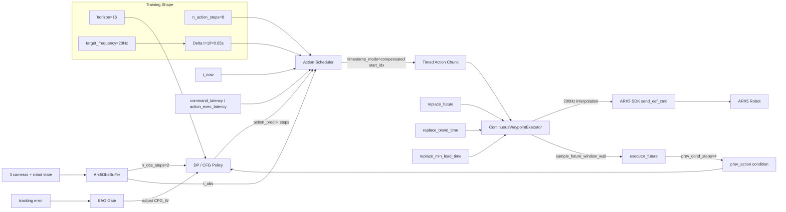

# ARX5 DP 部署时间对齐与参数关系

## 结论

`principle.docx` 里的核心判断对当前项目是有价值的：ARX5 上 DP 抖动、回溯、chunk 边界不连续，主要不是模型随机性单独造成的，而是观测时间、推理时间、动作时间戳、executor 实际执行时间没有统一。

当前项目已经对应做了三类修正：

- 普通 DP：`timestamp_mode=compensated`，从 `action_pred` 的真实时间位置取 action。
- 普通 DP / CFG：`ContinuousWaypointExecutor` 支持 `replace_future + replace_blend_time + replace_min_lead_time`。
- CFG：优先使用 `executor_future` 作为 `prev_action` 条件，而不是直接使用旧 chunk 的固定下标。

## 可取之处

`principle.docx` 中以下观点可以直接用于当前项目：

- `action_horizon=8` 不应该理解成“永远取数组前 8 步”，而应该理解成“从真实接管时间开始执行 8 个有效动作”。
- 固定 `preview_time` 只能缓解抖动，不能严格解决时间对齐。
- `executor_future` 比旧 chunk tail 更适合作为 CFG 的 previous action condition。
- CFG 变平滑但成功率下降，通常说明 condition 过强、时间错位或 tracking error 让 condition 变成错误约束。
- 后续评估不能只看成功率，还要记录 `boundary_pos_jump`、`boundary_rot_jump`、`dropped`、`start_idx`、`obs_age`、`infer_latency`。

## 需要谨慎的地方

以下点不能直接照搬，需要结合 ARX5 当前代码：

- `condition=8` 不适合你当前 `horizon=16` 的 CFG。当前项目默认 `prev_cond_steps=4` 更稳。
- `preview_time=0.1` 不是最终方案，它会把动作整体推迟，可能降低抓取时机精度。
- “后 6 步 action”不等于 `executor_future`。`executor_future` 是 executor 当前时间轴上已经过插值、限速、blend 后的未来轨迹。
- SAIL / LAGO 里的完整系统还包括 tracking-error gating、delay randomization、更强控制器。你当前只是做了其中一部分。

## 项目中的重要参数

### 训练结构参数

| 参数 | 当前位置 | 当前值 | 含义 |
|---|---|---:|---|
| `horizon` | `train_diffusion_unet_arx5_hybrid_workspace.yaml` | `16` | UNet 预测的完整动作序列长度 |
| `n_obs_steps` | 同上 | `2` | 输入网络的观测帧数 |
| `n_action_steps` | 同上 | `8` | policy 输出给部署层的默认执行长度 |
| `target_frequency` | task dataset config | `20Hz` | 训练数据重采样频率 |
| `num_inference_steps` | policy config | `8` | 扩散采样去噪步数 |
| `prev_cond_steps` | CFG config | `4` | CFG 输入的未来旧轨迹条件长度 |
| `prev_chunk_dropout` | CFG config / train script | 常用 `0.3` | 训练时随机丢弃 prev_action condition 的概率 |

### 普通 DP 部署参数

位置：`scripts/run_dp_pro.sh`

| 参数 | 当前默认 | 含义 |
|---|---:|---|
| `DP_TIMESTAMP_MODE` | `compensated` | 根据观测延迟动态选择 `action_pred` 起始下标 |
| `DP_SUBMIT_EXTRA_STEPS` | `0` | 额外提交未来点；当前不用它补偿 |
| `steps_per_inference` | `8` | 每次希望实际执行的有效 action 数 |
| `command_latency` | `0.01s` | 给 action timestamp 增加的命令提前量 |
| `action_exec_latency` | `0.01s` | 判断 action 是否过期的执行提前量 |
| `preview_time` | `0.05s` | ARX5 SDK 单点命令的低层 preview |
| `continuous_frequency` | `200Hz` | executor 高频插值执行频率 |
| `continuous_max_pos_speed` | `0.65m/s` | executor 位置速度上限 |
| `continuous_max_rot_speed` | `1.05rad/s` | executor 姿态速度上限 |
| `DP_REPLACE_FUTURE` | `1` | 替换 executor 未执行的未来轨迹 |
| `DP_REPLACE_BLEND_TIME` | `0.10s` | 新旧未来轨迹边界融合时间 |
| `DP_REPLACE_MIN_LEAD_TIME` | `0.06s` | 保护近未来轨迹，不立刻替换马上要执行的点 |

### CFG 部署参数

位置：`scripts/run_dp_cfg_pro.sh`

| 参数 | 当前默认 | 含义 |
|---|---:|---|
| `CFG_W` | `0.5` | CFG guidance 权重 |
| `CFG_PREV_COND_STEPS` | `4` | 输入 UNet 的 previous action 条件长度 |
| `CFG_PREV_LATENCY` | `0.20s` | 估计推理延迟，用于采样 executor future |
| `CFG_PREV_LATENCY_MARGIN` | `0.03s` | 给 latency 估计加安全余量 |
| `CFG_PREV_MAX_LATENCY` | `0.25s` | latency 上限 |
| `CFG_PREV_MAX_START_IDX` | `4` | previous condition 最大起始下标 |
| `EAG_MODE` | `on` | tracking error 大时关闭/减弱 CFG guidance |
| `EAG_POS_THRESHOLD` | `0.02m` | EAG 位置误差阈值 |
| `EAG_ROT_THRESHOLD` | `0.05rad` | EAG 姿态误差阈值 |
| `CFG_DROP_PREFIX` | `on` | 执行时丢弃已经被 condition 约束的前缀 |
| `CFG_PREFIX_KEEP_STEPS` | `0` | 被 condition 约束的前缀保留步数 |
| `REPLACE_BLEND_TIME` | `0.12s` | CFG executor 新旧轨迹融合时间 |
| `REPLACE_MIN_LEAD_TIME` | `0.06s` | CFG executor 近未来保护窗口 |

## 数学定义

令：

- 控制频率：`f`
- 控制周期：`\Delta t = 1 / f`
- 观测最新时间：`t_obs`
- policy 推理完成时间：`t_now`
- command latency：`\delta_cmd`
- action exec latency：`\delta_exec`
- prediction horizon：`H = 16`
- action horizon：`A = 8`
- previous condition horizon：`C = prev_cond_steps`

### compensated 起始下标

普通 DP 中：

```text
t_base = t_obs + delta_cmd
t_min = t_now + max(delta_cmd, delta_exec)
d = ceil((t_min - t_base) / Delta t)
start_idx = clamp(d, 0, H - 1)
```

实际提交的 action 是：

```text
u_submit = [u_start_idx, u_start_idx+1, ..., u_start_idx+A-1]
```

其时间戳是：

```text
tau_i = t_base + i * Delta t
```

最终只保留：

```text
tau_i > t_now + delta_exec
```

目标是让：

```text
len(u_valid) approx A
```

### preview time

ARX5 SDK 单点命令的低层执行时间近似是：

```text
t_sdk_target = t_send + preview_time
```

`preview_time` 增大通常会更平滑，但会增加闭环滞后。

### replace future

executor 中新 chunk 的第一个替换时间：

```text
t_replace = max(tau_0, t_now + replace_min_lead_time)
```

在 `t_replace` 之前保留旧轨迹：

```text
x_exec(t) = x_old(t), t < t_replace
```

在融合窗口内：

```text
alpha(t) = clamp((t - t_replace) / replace_blend_time, 0, 1)
x_exec(t) = (1 - alpha(t)) x_old(t) + alpha(t) x_new(t)
```

窗口之后：

```text
x_exec(t) = x_new(t)
```

### boundary jump

边界跳变量：

```text
J_pos = ||p_new(t_replace) - p_old(t_replace)||_2
J_rot = ||r_new(t_replace) - r_old(t_replace)||_2
J_gripper = |g_new(t_replace) - g_old(t_replace)|
```

这些值越小，chunk 间越连续。

### CFG guidance

CFG 使用 conditional 和 unconditional 两个预测：

```text
epsilon_guided = epsilon_uncond + w * (epsilon_cond - epsilon_uncond)
```

其中：

- `w = CFG_W`
- `epsilon_cond` 使用 `prev_action`
- `epsilon_uncond` 不使用 `prev_action`

当 tracking error 大时，EAG 会减弱或关闭 guidance：

```text
if ||p_actual - p_condition|| > theta_pos or ||r_actual - r_condition|| > theta_rot:
    w_effective = 0
else:
    w_effective = CFG_W
```

### tracking error

```text
e_pos(t) = ||p_scheduled(t) - p_actual(t)||_2
e_rot(t) = ||r_scheduled(t) - r_actual(t)||_2
```

当 `e_pos` 或 `e_rot` 较大时，旧 future condition 可能不可信。

## 参数关系图



## 后续建议

优先做两个脚本：

1. `analyze_policy_log.py`

统计：

```text
obs_age / infer_latency / start_idx / dropped / n / dt0 / dtN
boundary_pos_jump / boundary_rot_jump / tracking_hold
```

2. `compare_policy_logs.py`

对比：

```text
DP-EFF
DP-Joint
DP-CFG
ACT-EFF
ACT-Joint
```

这样后续判断模型好坏时，不会把 executor 问题误认为模型问题。
